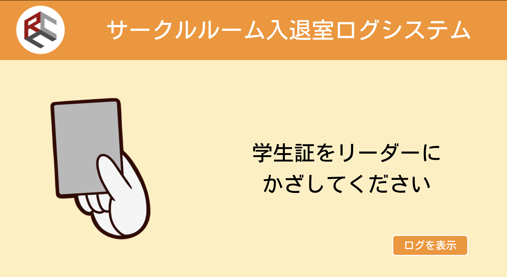

# CERS - COVID-19 Entrance Recording System

This system record someone entered or leaved the room.

## Require
* Java OpenJDK 11
* docker-compose
* Node.js v12.16.1

## How to run
`$ java -jar cers.jar`

## How to run on development environment
1. Clone this repository.
1. Run `$ cd cers` on your turminal.
1. Run `$ docker-compose up -d`.
1. On macOS or Linux OS, Run `$ ./gradlew bootRun`. On windows, Run `$ ./gradlew.bat bootRun`.
1. Access http://localhost:8080 .

## How to run front-end development environment
1. Run `$ cd cers/front` on your turminal.
1. Run `$ npm run serve`.

## How to build application
1. Run `$ cd cers` on your turminal.
1. On macOS or Linux OS, Run `$ ./gradlew build`. On windows, Run `$ ./gradlew.bat build`.
1. When build successful, you can find .jar file in `build/libs`.

## API docs
This project support Swagger UI.
1. Run CERS develop environment.
1. Access http://localhost:8080/swagger-ui.html .

## LICENSE
Under MIT License.
